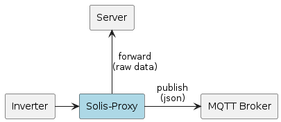

# Solis-Proxy

Solis-Proxy is a simple server that listens for connections from Ginlong Solis 3 Phase Solar Inverter and publish received data to MQTT broker. It also can forwards data to remote server. Tested on Solis-3P6K-4G (firmware: 001A - main, 0028 - slave) and WiFi Data Logging Stick (firmware: MW_08_0501_1.58).



Messages sending over MQTT:

- **Data logger information frame**

Topic: _[base_topic]_/_[data_logger_sn]_/information

```
{
  "data_logger_sn": "123456789",              // Data logger serial number
  "total_working_time": 7657381,              // Total working time [sec]
  "signal_quality": 100,                      // WiFi signal quality [%]
  "firmware": "MW_08_0501_1.58",              // Firmware version
  "mac_address": "112233445566",              // MAC address
  "ip_address": "192.168.0.115"               // IP address
}
```

- **Inverter data frame**

Topic: _[base_topic]_/_[data_logger_sn]_/data

```
{
  "dts": 1620559150,                          // Data timestamp [seconds since epoch]
  "data_type": "real-time",                   // Data type ("real-time" / "historical")
  "data_logger_sn": "123456789",              // Data logger serial number
  "total_working_time": 7657381,              // Total working time [sec]
  "inverter_sn": "123456789012345",           // Inverter serial number
  "temperature": 53.3,                        // Inverter temperature [C]
  "v_dc1": 266.7,                             // DC 1 input voltage [V]
  "i_dc1": 11.0,                              // DC 1 input current [A]
  "v_dc2": 271.2,                             // DC 2 input voltage [V]
  "i_dc2": 11.0,                              // DC 2 input current [A]
  "v_ac1": 236.3,                             // AC 1 output voltage [V]
  "i_ac1": 7.9,                               // AC 1 output current [A]
  "v_ac2": 238.6,                             // AC 2 output voltage [V]
  "i_ac2": 7.8,                               // AC 2 output current [A]
  "v_ac3": 238.9,                             // AC 3 output voltage [V]
  "i_ac3": 7.8,                               // AC 3 output current [A]
  "f_grid": 50.03,                            // Current frequency [Hz]
  "power": 5700,                              // Current power [W]
  "kwh_today": 26.6,                          // Energy generated today [kWh]
  "kwh_yesterday": 29.7,                      // Energy generated yesterday [kWh]
  "kwh_this_month": 254,                      // Energy generated this month [kWh]
  "kwh_last_month": 746,                      // Energy generated last month [kWh]
  "kwh_this_year": 2036,                      // Energy generated this year [kWh]
  "kwh_last_year": 257,                       // Energy generated last year [kWh]
  "kwh_total": 2293.0,                        // Total energy generated [kWh]
  "inverter_model": "0078",                   // Inverter model
  "firmware_slave": "0028",                   // Firmware version (slave)
  "firmware_main": "001a",                    // Firmware version (main)
  "status": 3                                 // Status ("3" - Generating)
}
```

## Requirements

- Python 3 (additional packages: _paho-mqtt_, _pyyaml_)
- MQTT Broker

## Configuration

Configuration is done through files:
- [config.yml](config/config.yml)
- [logging.yml](config/logging.yml)

## Setup

1. Configure and start Solis-Proxy
2. Log in to "Data Logging Stick" module ([http://<ip_address>/config_hide.html](http://<ip_address>/config_hide.html))
3. In "Server A Setting" section, enter IP address and port number on which Solis-Proxy is listening
